# Тестування працездатності системи

Тестування сервісу проводилося за допомогою Postman.

## Запуск сервера

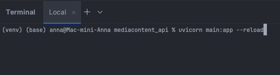

## GET /user

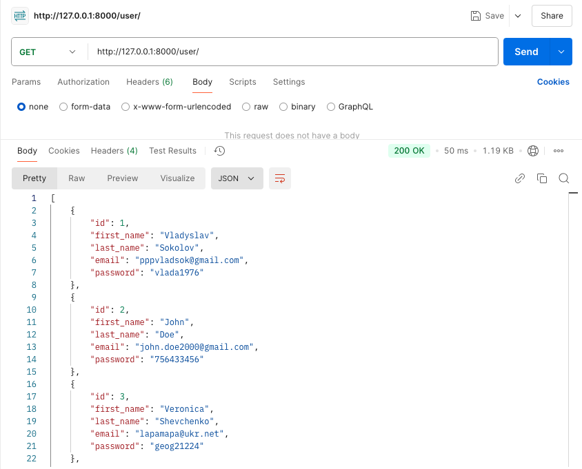

## GET /user/:id

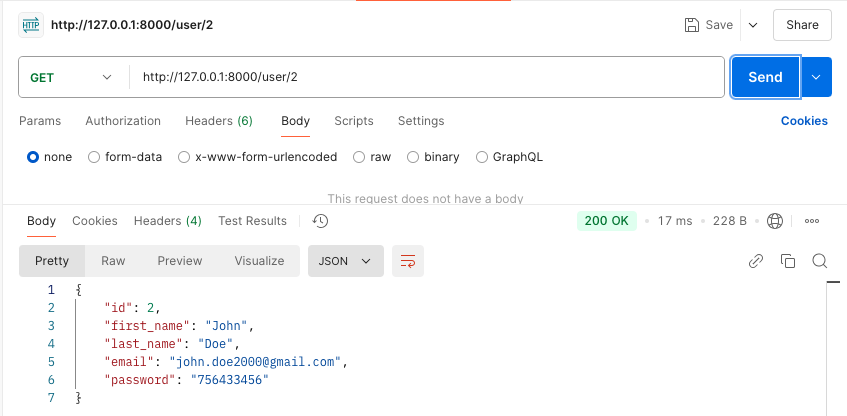

## POST /user

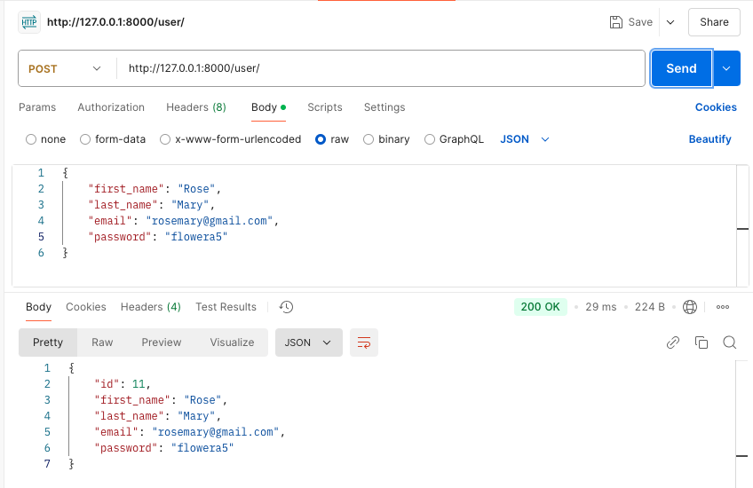

## PATCH /user/:id

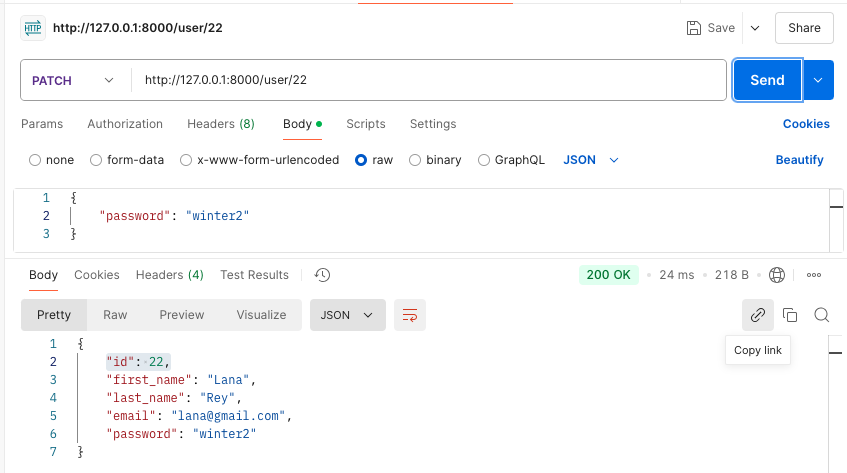

## DELETE /user/:id

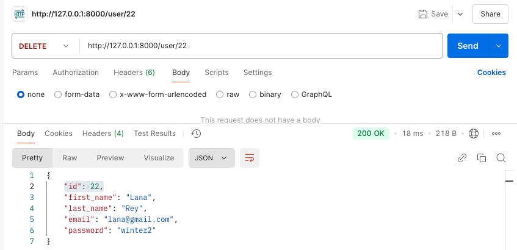

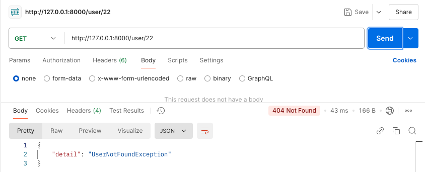

## GET /mediacontent

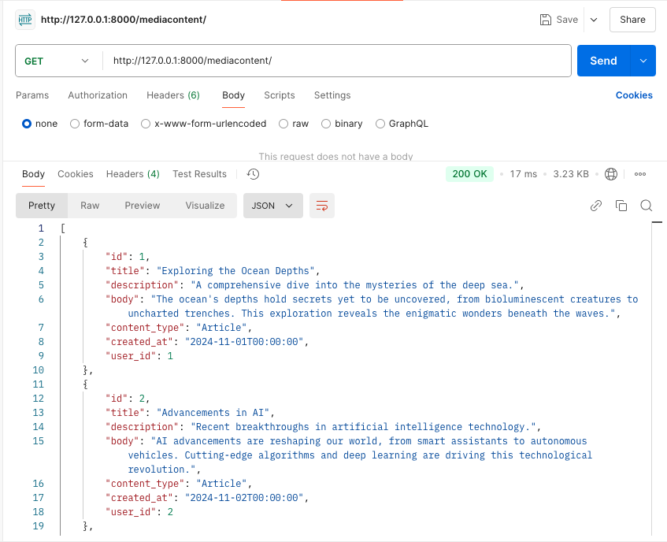

## GET /mediacontent/:id

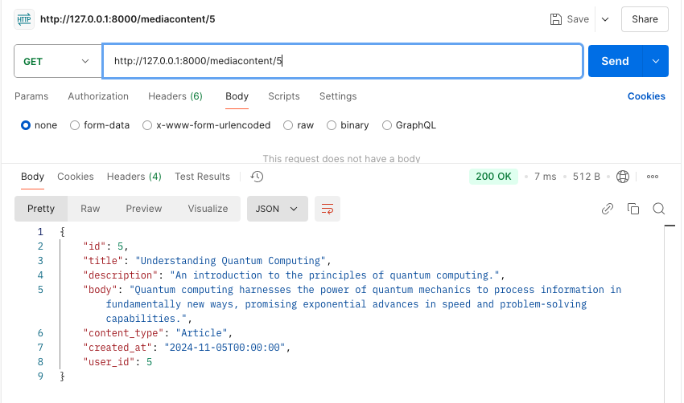

## POST /mediacontent

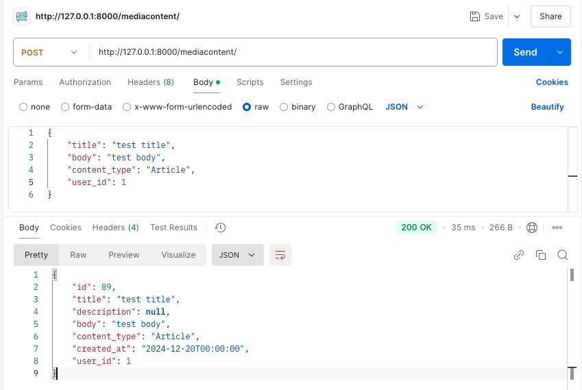

## PATCH /mediacontent/:id

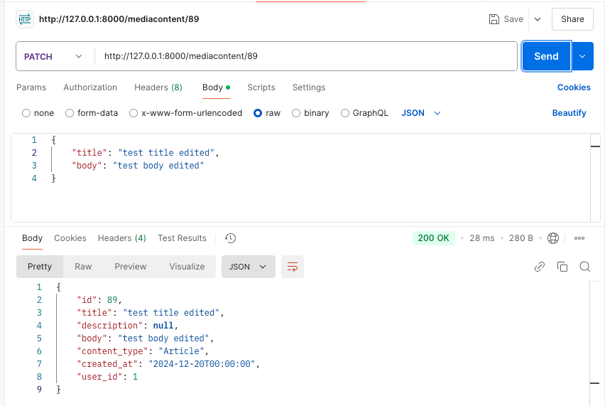

## DELETE /mediacontent/:id

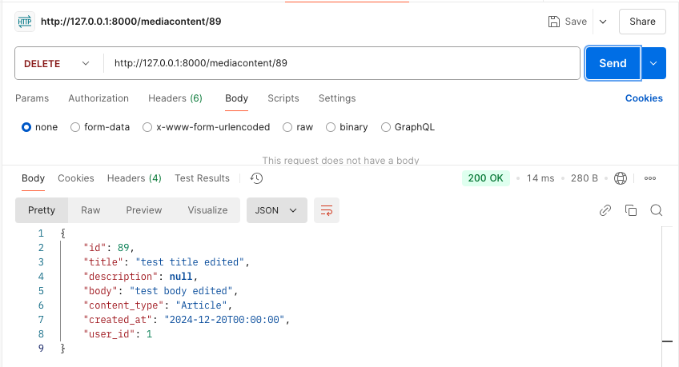

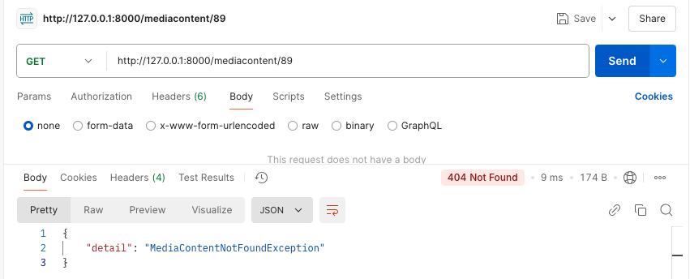

___

## EXCEPTION(User): DataMissingException

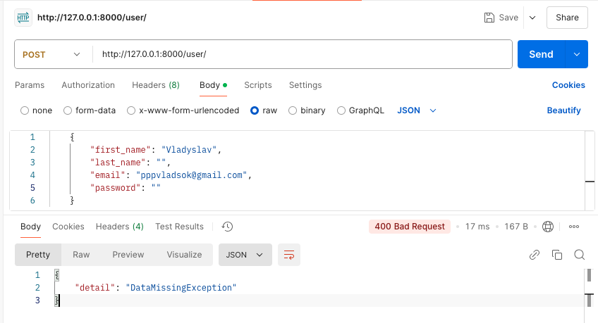

## EXCEPTION(User): AlreadyRegisteredException

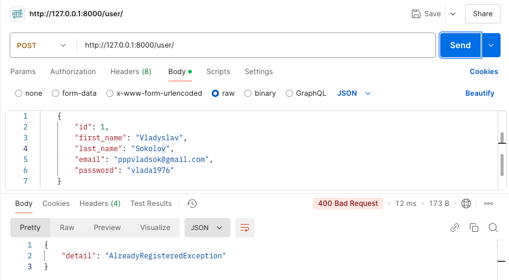

## EXCEPTION(User): UserNotFoundException

## EXCEPTION(MediaContent): RequiredFieldsMissingException

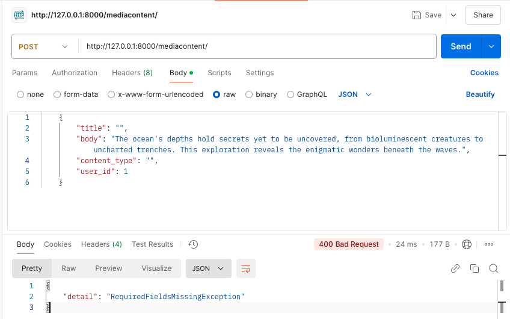

## EXCEPTION(MediaContent): MediaContentNotFoundException

## EXCEPTION(MediaContent): ContentIdExistsException

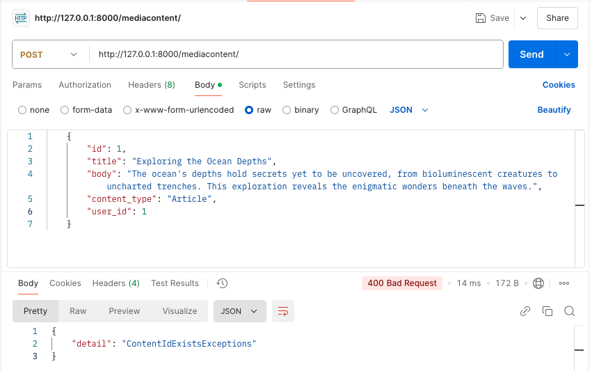
